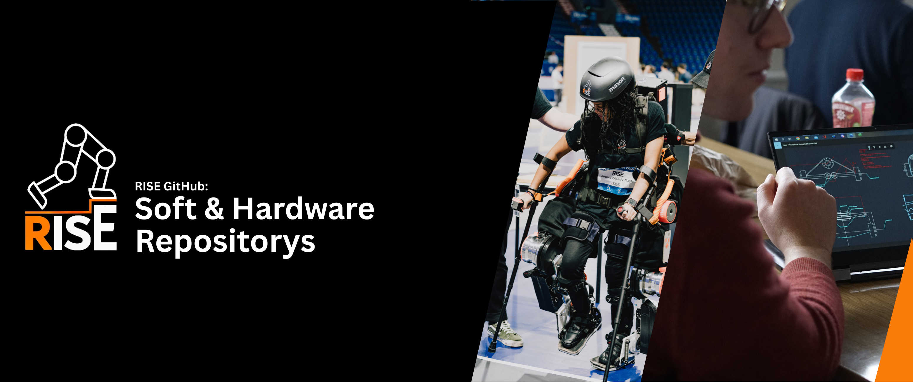

## Welcome to the RISE organization - a hub for soft and hardware within the RISE project. 
----
**The RISE project is developing robotic, bipedal exoskeletons for paraplegics and other medical indications.** 

Here we share and host repositories that contain the code that makes the actuators of our exoskeletons move, the sensors sense and the control loops run. We also host hardware files: PCBs, simulation results, measurement results and final models. 

If you have an idea of how to improve some component of the exoskeleton, feel free to open up an issue or even create a pull request! We are always happy about feedback from people actually using some part of our software.

### Useful links!
Here you can find useful links to various resources related to the RISE project!

- [Our Website](https://blogs.tu-berlin.de/mt_rise/en/home/)
- [Code of conduct](https://github.com/riserobotics/rise-os-core/blob/main/CONTRIBUTING.md)
- [Internal Documentation](https://riseos-docs-e1325d.gitlab-pages.tu-berlin.de/)
- [See the exoskeleton in action!](https://cybathlon.com/de/events/video-center)
